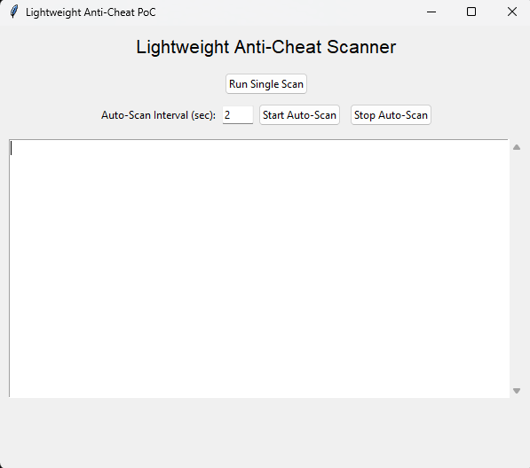
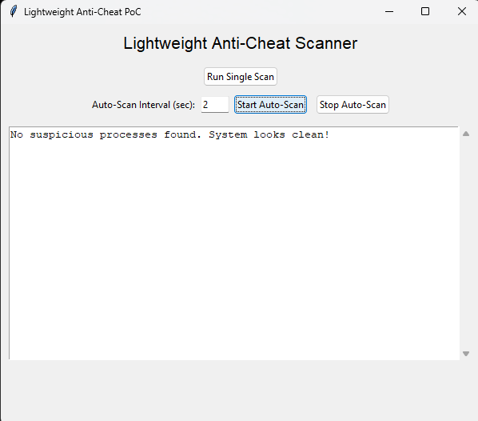
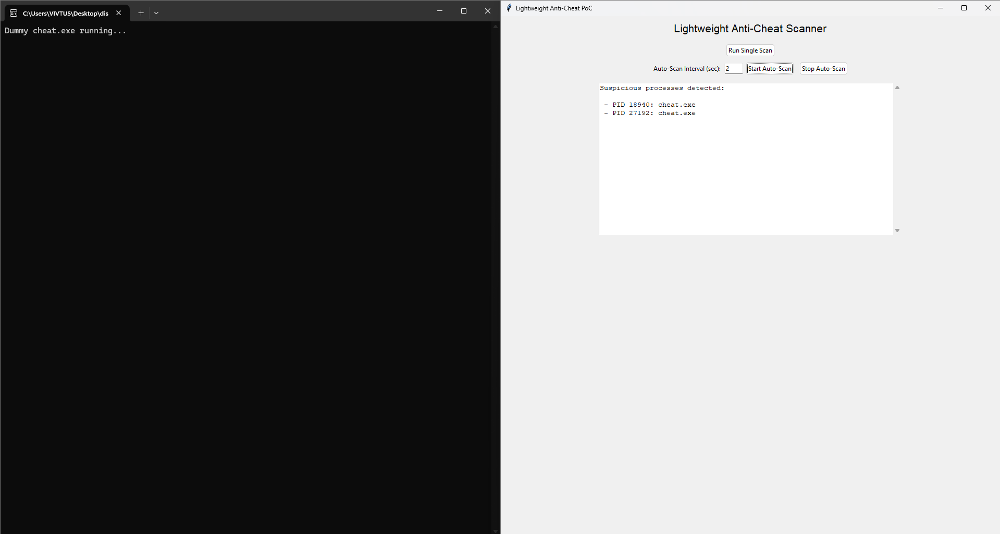
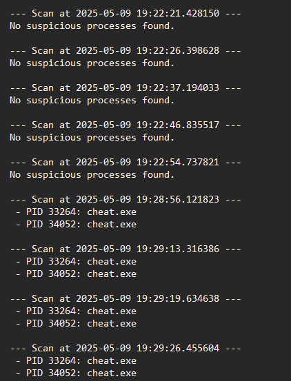

# 🛡️ Lightweight Anti-Cheat PoC

> ⚠️ **Proof of Concept** — For educational and experimental purposes only.  
> This is *not* production-ready. Use at your own risk.

## 🚀 Overview
This project is a **lightweight, modular anti-cheat proof of concept** designed to demonstrate basic cheat detection mechanisms with minimal system overhead.

- ✅ Focus on low performance impact  
- ✅ Modular design for easy testing  
- ✅ Simple to integrate with game prototypes  

## 🎯 Features
- **Memory Scanner**  
  Detects known cheat signatures in process memory.

- **Process Watchdog**  
  Monitors suspicious third-party processes commonly used in cheating.

- **Basic Integrity Checks**  
  Verifies critical game files and memory regions haven't been tampered with.

- **Lightweight Footprint**  
  No kernel drivers, no invasive hooks — pure user-mode PoC.

## 📦 Requirements
- Windows 10/11 (x64)  
- .NET 6.0 SDK (for building)  
- Admin rights (for some detection modules)

## 🛠️ Getting Started

```bash
git clone https://github.com/amandeep-2004/lightweight-anti-cheat-poc.git
cd lightweight-anti-cheat-poc
pip install -r requirements.txt
python gui.py
```
## 📸 Demo
  # Initial Page
   

  # Cheat Detection Process
   

   
 # Log File

 
   
## 🚧 Limitations:
- Only detects processes by name (e.g., 'cheat', 'trainer', 'injector').
- Cannot detect kernel-level cheats or name-masquerading processes.
- Designed as a lightweight proof-of-concept, not a production anti-cheat.


